    

```{r xaringan-themer, include = FALSE}
# library(xaringanthemer)
# mono_accent(base_color = "#252525", link_color	= "rgb(198, 219, 239)")
```

<style>
.onehundredtwenty {
  font-size: 120%;
   }

<style>
.ninety {
  font-size: 90%;
   }

.eightyfive {
  font-size: 85%;
   }
   
.eighty {
  font-size: 80%;
   }
   
.seventyfive {
  font-size: 75%;
   }
   
.seventy {
  font-size: 70%;
   }
</style>


```{r setup, echo = F, include=F}
# include=FALSE
options(htmltools.dir.version = FALSE)

pacman::p_load(tidyverse, xaringan)

knitr::opts_chunk$set(echo = F, warning = F, error = F, message = F)

```


<br>
<br>
<br>
<br>
<br>
<br>
<br>
<br>

.onehundredtwenty[

Research Question:

> What role does deliberation play for regime legitimacy across the world? 

]


---

## Outline

.onehundredtwenty[

1. Theoreteical Framework
2. Data & Methodology
3. Challenges
4. Analysis & Results
5. Conclusions & Future Research

]


---

class: inverse, center, middle

## Theoretical Link between <br> Deliberation and Regime Legitimacy 


---

## Theory

+ Central claim of deliberative theory: 
    + making it possible to arrive at (more) legitimate desicions


--
+ Conceptualization of legitimacy as regime support 


--
+ General assumption: Deliberative qualities of a political system increase support from its citizens


--
+ *Authoritarian deliberation*: Might decrease support due to increasing democratic capabilites


---

class: inverse, center, middle


## Data & Methodology


---

#### Data & Methodology

**Individual-Level Data**
+ Merging of the following datasets: 
  + Afrobarometer Survey, Round 5 and Round 6 (data from 2011-2015)  
  + Asian Barometer Survey, Wave 3 and Wave 4 (2010-2015) 
  + AmericasBarometer (2010-2014) 
  + European Social Survey, Round 6 (2012) 
  + Latinobarómetro (2015) 
  + World Values Survey (2010-2014)

+ In total 316,938 individual cases in 119 Countries
  + weighted to same sample size (=1000)


--

**Country-Level Data**
+ "Varieties of Democracy"-Dataset: Deliberative Component Index
+ Control variables come from V-Dem and the QoG-Dataset
+ Lagging of Independent Variables (Averaging from 2000 - 2010)

---

#### Data & Methodology

.ninetyfive[

+ Control Variables
    + Micro Level
        + Age
        + Sex (Male/Female)
        + Financial Security
        + Education
        + Employment (0/1)
    + Macro Level
        + Polity/FH
        + Democracy (0/1)
        + Autocracy (0/1)
        + logged GDP per capita
        + logged Population
        + Life Expectancy
        + Urban Pop. Ratio
    + Survey dummies
        + WVS, Afrobarometer, Latinobarometro, Americasbarometer, Asianbarometer, ESS
        
]

---


## Operationalization of Regime Support

Three types of traditional political branches
+ executive (political leadership)
+ judicial and legal system (courts and police)
+ legislation (parliament) 


```{r}
htmltools::includeHTML("tables/factor_analysis.html")
```


---

## Deliberative Component Index (DCI)?

+ short description?
+ Table with five components?

<center>
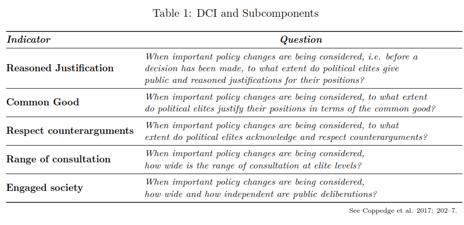
</center>


---

## World Maps

<center>
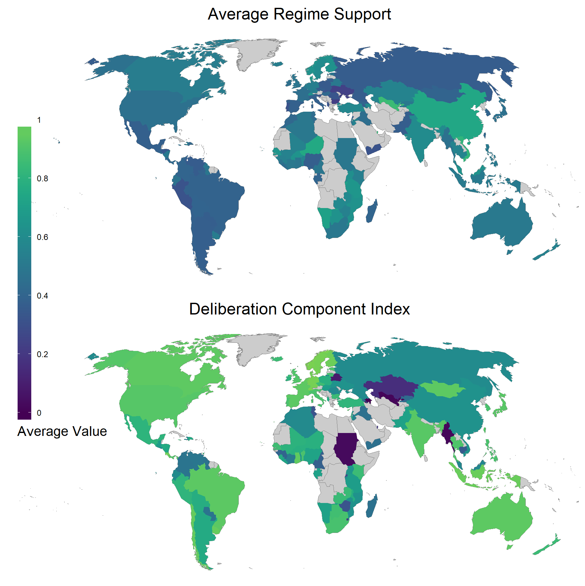
</center>

---

class: inverse, center, middle


## Challenges

---

## Challenges

*Two major challenges emerged:*

+ Colinearity between Deliberation indicators and Democracy Measures

--

+ Possibly biased self-reported regime support 

--

<br>

#### Multicolinearity issue


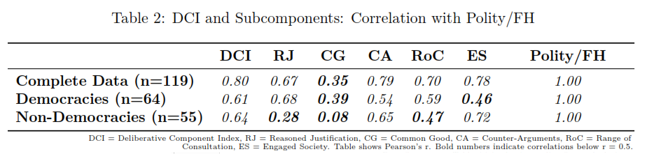

---

#### Correlation between DCI and Polity/FH


<center>
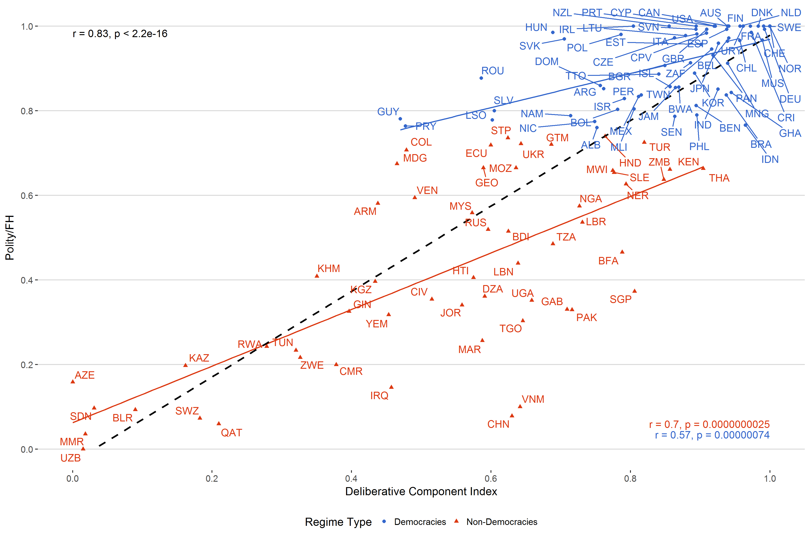
</center>


---


#### Possibly biased self-reported Regime Support 


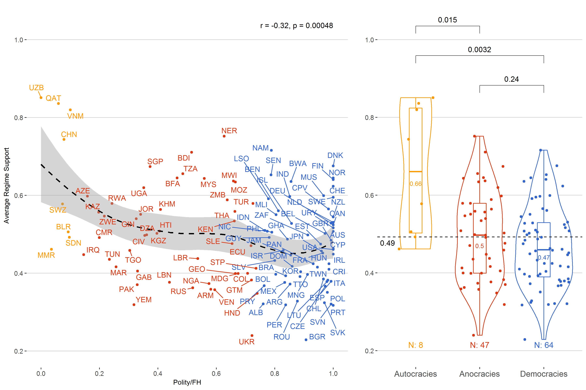


---

#### Correlation between Regime Support and Discussion Suppression 


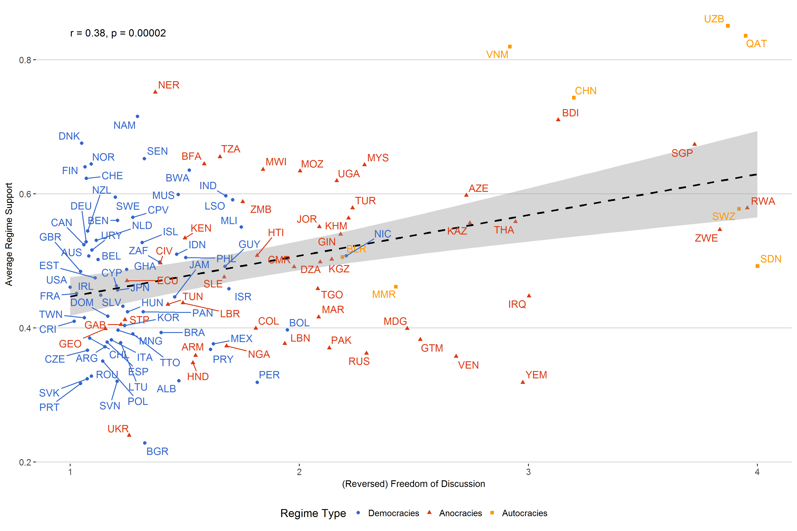


---

#### Weighting of Regime Support

<br>


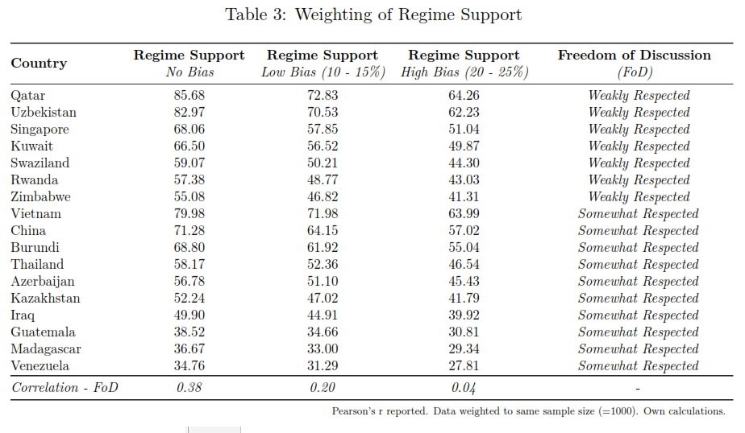

---

class: inverse, center, middle


## Analysis & Results

---

## Analysis

+ Multilevel Models
    + In total 91 seperate models
    + DVs: Regime Support (No, Low, High Bias)
    + Main IVs: All six Deliberation indicators
    

---

## Results


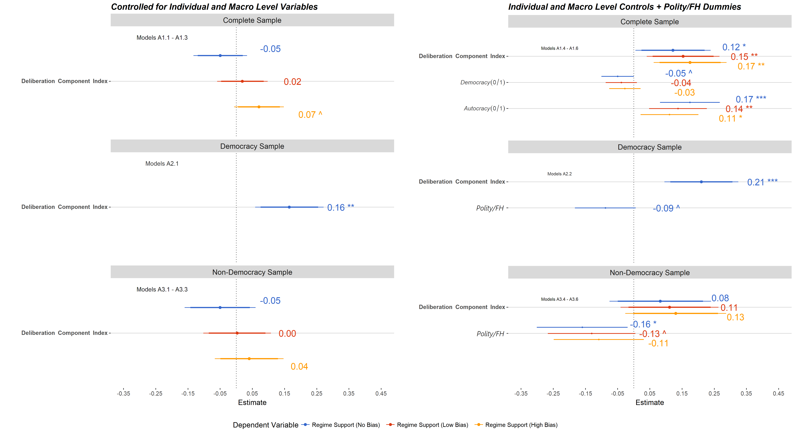


---

### Model Comparisons -Just Polity/FH Models vs. Complete Models

<br>

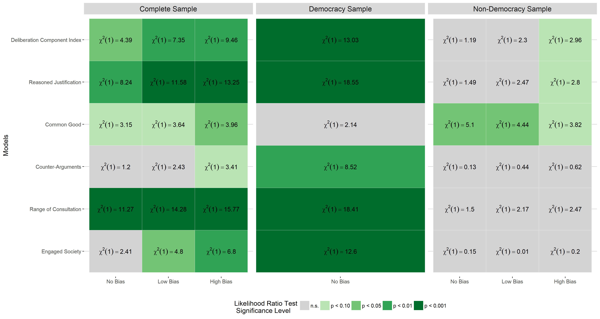

---

class: inverse, center, middle

## Conclusions & Future Research

---

## Conclusions & Future Research

* No simple answer to research question
 + deliberation seems to have a positive effect on regime support in democracies
 + less robust and ambiguous results for non-democracies and complete sample
    
    
* Presumably biased regime support
 + should be taken into account 
 + possible remedies? (e.g. weighting procedures, survey design)

* Validity of the DCI
    + more sensitive approaches to measure deliberation on the country level are neccessary
    + nevertheless interesting differences regarding the subsamples

---

class: inverse, center, middle


## Thanks for Listening!

Full Paper: <a href='https://www.academia.edu/36656020/Deliberation_Across_the_World_A_Cross-National_Examination_of_the_Link_Between_Deliberation_and_Regime_Legitimacy'>Deliberation Across the World</a>

Slides: <a href='deliberation-and-legitimacy.netlify.com'>https://deliberation-and-legitimacy.netlify.com </a>

Online Appendix can be found <a href='https://favstats.github.io/delib_mod_database'>here</a>

Code and Data on <a href='https://github.com/favstats/paper_delib'>GitHub</a>


---

## References

Hawley, G. (2017). Making Sense of the Alt-right. Columbia University Press.

Marwick, A., & Lewis, R. (2017). Media manipulation and disinformation online. New York: Data & Society Research Institute.


---

class: inverse, center, middle

## Appendix

---


#### Operationalization of Regime Support

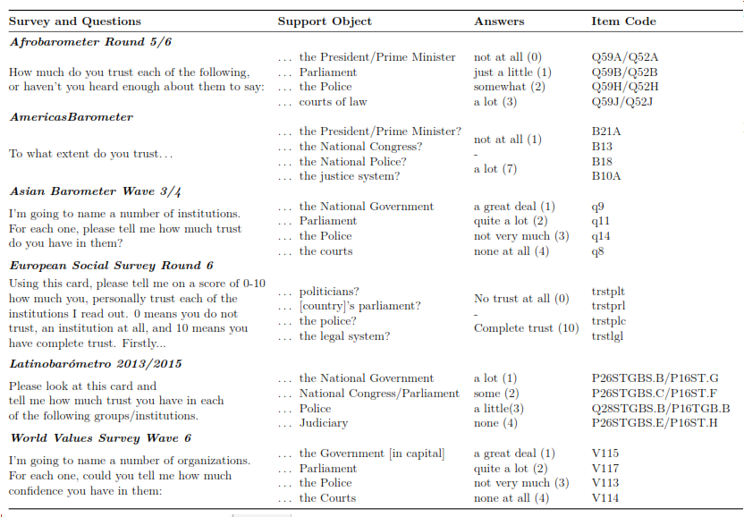

---

### Maps - Deliberation

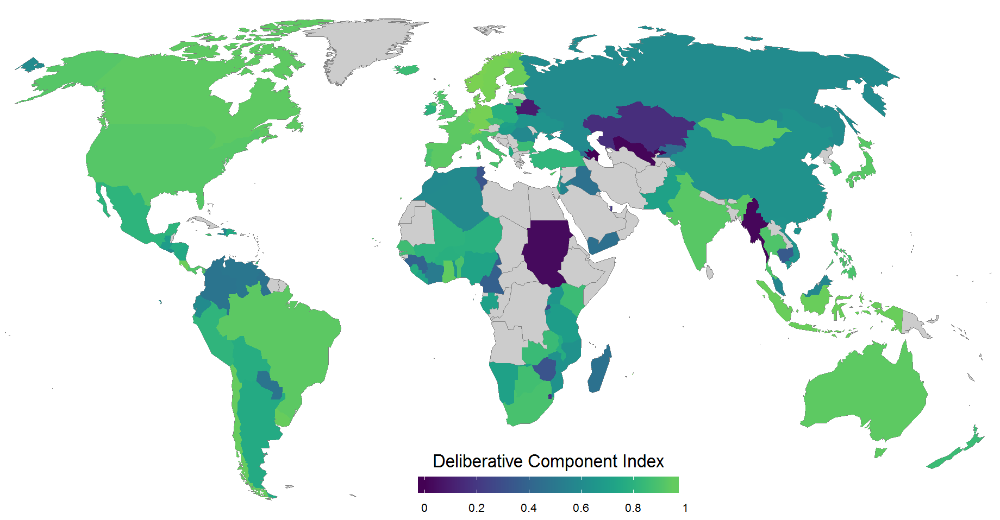

---

### Maps - Regime Support

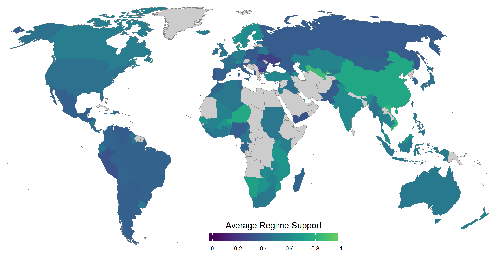

---

### Coefficent Plots - Complete Sample

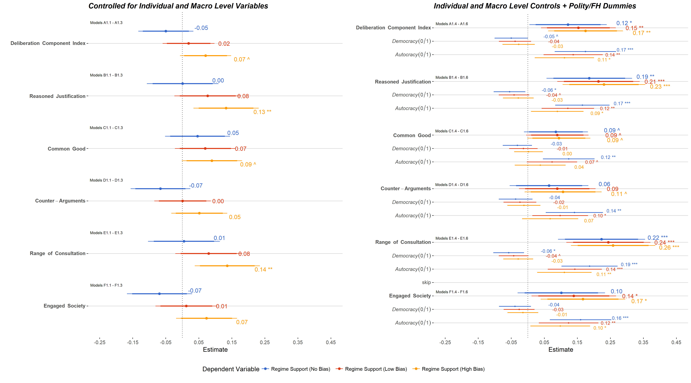

---

### Coefficent Plots - Democracy Sample

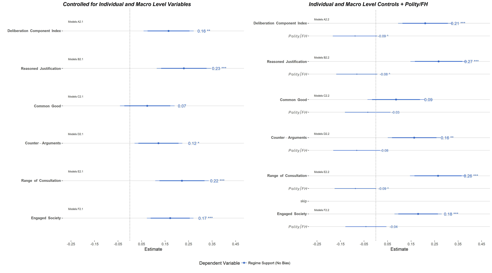

---

### Coefficent Plots - Non-Democracy Sample

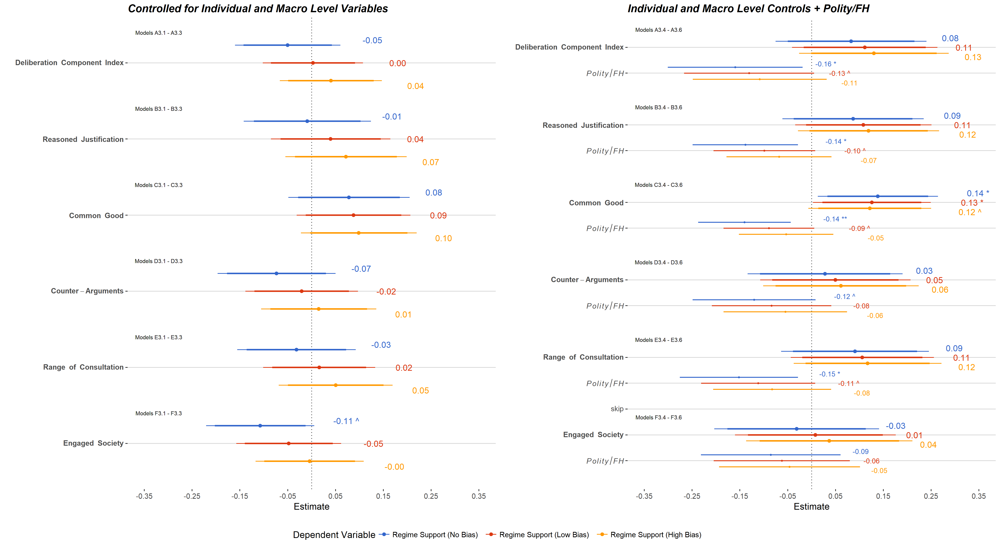

---


### Model Comparisons - Just Control Models vs. Just Deliberation Models

<br>

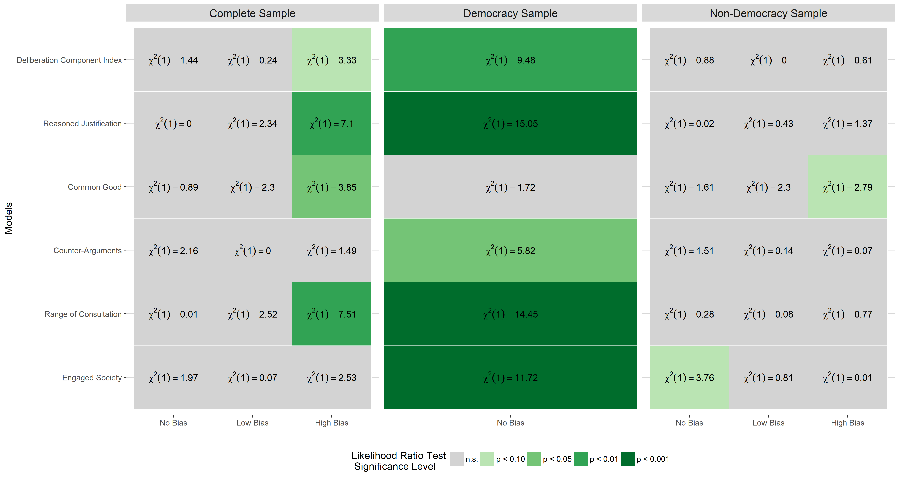

---

### Model Comparisons - Complete Sample

<br>
<br>

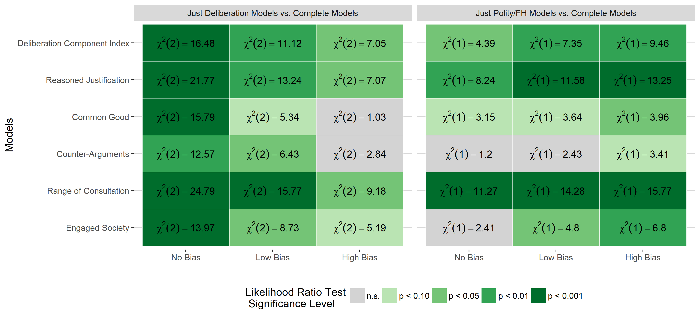

---

### Model Comparisons - Democracy Sample

<br>
<br>

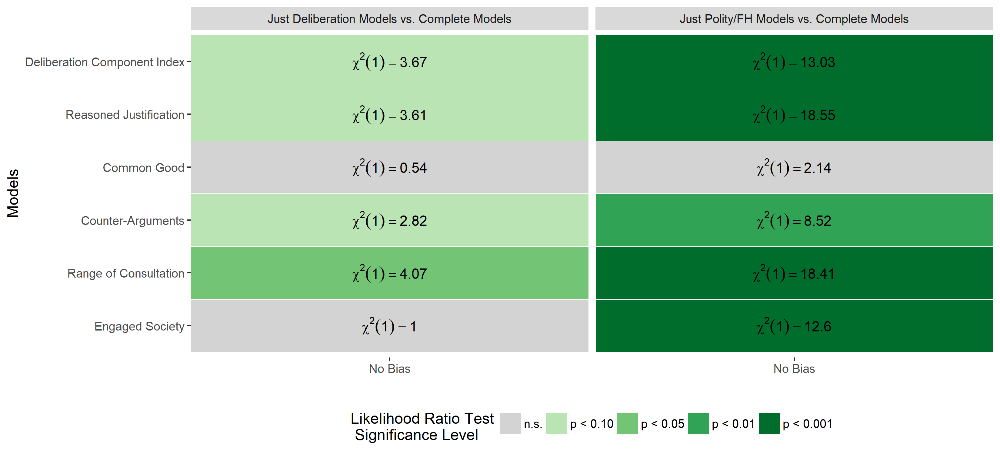

---

### Model Comparisons - Non-Democracy Sample

<br>
<br>

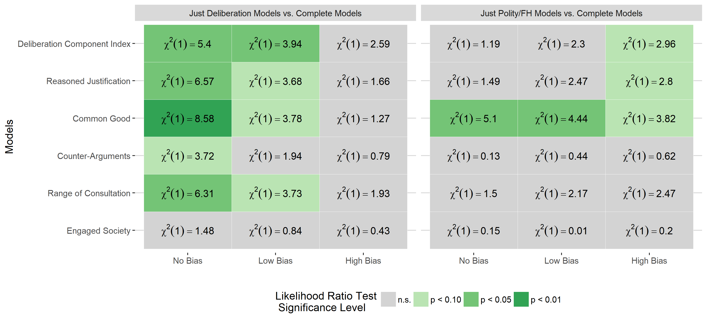


